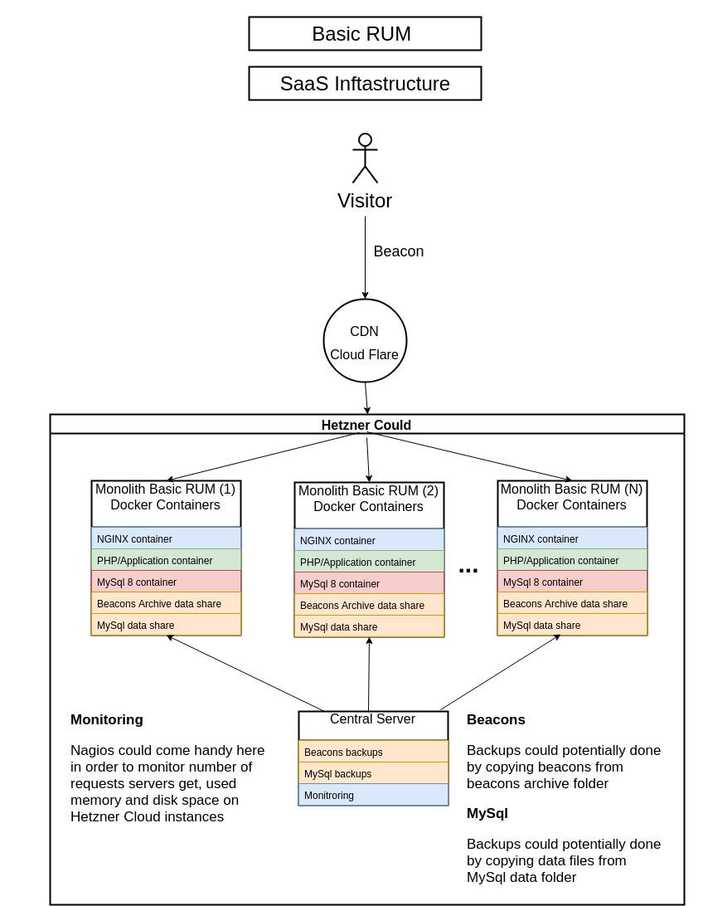

# Infrastructure
A project that aims to provide easy setup for local, dev and production environment. As final result should have running services for: Catching beacons and store them, decode and import beacons in Basic RUM backoffice DB and finally run Basic RUM backoffice in order to generate diagrams.

Current draft of SaaS infrastructure:



# How to run infrastructure with terraform:
- Configure terraform/secret.tfvars:
```hcl-terraform
  # Hetzner
  hcloud_token = "your_hetzner_cloud_token"
  provision_ssh_key = "/path/to/your/.ssh/id_rsa"
  
  # Cloudflare
  cloudflare_email = "your cloudflare email"
  cloudflare_token = "your cloudflare token"
  
  # Domain
  domain = "yourcfdomain.com"
  
  # Rundeck 
  rundeck_admin_pass = "rundeck_admin_pass"
  rundeck_user_pass = "rundeck_use_pass" 
```
- Apply terraform config:
```bash
cd terraform
terraform init
terraform apply -var-file=secret.tfvars

```
